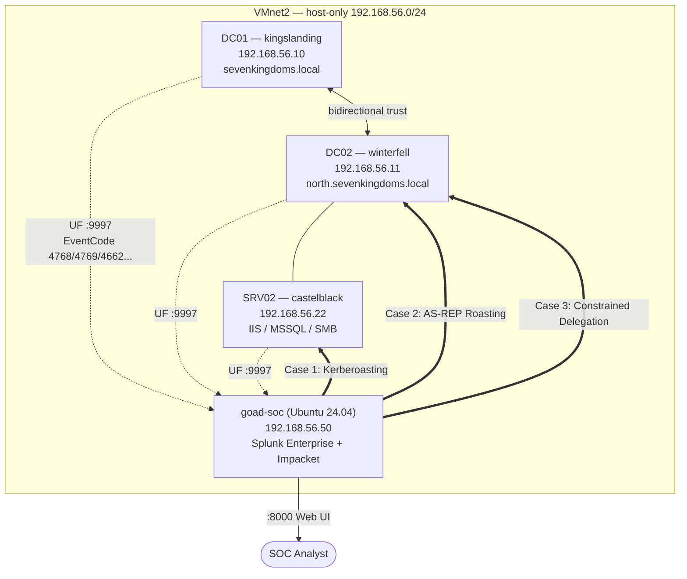

# Dựng lab SOC purple-team: GOAD-Light + Splunk — Overview & Lab Setup

> Series recap quá trình tự học của một sinh viên đang vật lộn với thị trường tuyển dụng SOC :) : dựng lab Active Directory (GOAD-Light), giám sát bằng Splunk, rồi tự tay tấn công + viết rule phát hiện cho từng kỹ thuật MITRE ATT&CK. Bài này (Part 0) nói về hạ tầng; các phần sau đi vào từng case tấn công cụ thể.

Toàn bộ AD lab dựng từ dự án mã nguồn mở **[GOAD (Game Of Active Directory) — Orange Cyberdefense](https://github.com/Orange-Cyberdefense/GOAD)**, biến thể **GOAD-Light** (3 VM, 1 forest, 2 domain — nhẹ hơn bản GOAD đầy đủ 5 VM/2 forest/3 domain, phù hợp cấu hình máy cá nhân).

## Vì sao làm lab này

-> Cày lab bỏ vào cv + học Win AD + làm quen với Splunk

Nguyên tắc xuyên suốt: Mỗi case đều đi đủ chu trình: recon thật → xác định mục tiêu dựa trên output recon  → khai thác → chứng minh impact thật → viết detection rule → kiểm chứng rule tự bắn trên traffic tấn công.

## Hạ tầng

Toàn bộ chạy trên 1 laptop, VMware Workstation Pro, mạng host-only riêng cho lab.

| Máy | IP | Vai trò | OS |
|---|---|---|---|
| **kingslanding** (DC01) | 192.168.56.10 | Domain Controller gốc — `sevenkingdoms.local` | Windows Server 2019 |
| **winterfell** (DC02) | 192.168.56.11 | Domain Controller con — `north.sevenkingdoms.local` | Windows Server 2019 |
| **castelblack** (SRV02) | 192.168.56.22 | Member server — IIS + MSSQL + SMB | Windows Server 2019 |
| **goad-soc** | 192.168.56.50 (lab) | Ansible control node + Splunk Enterprise + máy đóng vai attacker | Ubuntu 24.04 LTS |

Hai domain có **bidirectional trust**. `north.sevenkingdoms.local` là nơi chứa hầu hết bề mặt tấn công thú vị (theo thiết kế của GOAD).

## Sơ đồ hệ thống

### Sơ đồ gốc của dự án GOAD

Hai sơ đồ dưới đây là tài liệu chính thức của dự án GOAD, mô tả toàn bộ user/group/quan hệ tấn công (đường đỏ = quyền admin, đường xanh = RDP...) được cấy sẵn trong lab. Nguồn: [Orange-Cyberdefense/GOAD](https://github.com/Orange-Cyberdefense/GOAD), thư mục [`docs/img/`](https://github.com/Orange-Cyberdefense/GOAD/tree/main/docs/img).

**Sơ đồ GOAD-Light** (đúng biến thể đang dùng trong lab này):

**Sơ đồ toàn bộ họ lab GOAD** (GOAD-Mini / GOAD-Light / GOAD đầy đủ / Extensions — để thấy GOAD-Light nằm ở đâu trong bức tranh lớn hơn):

### Sơ đồ giám sát (tự vẽ) — lớp Splunk mà sơ đồ gốc không có

Hai sơ đồ trên mô tả bề mặt tấn công AD, nhưng không thể hiện lớp **giám sát/SOC** được thêm vào cho lab này. Sơ đồ dưới đây bổ sung đúng phần đó: hướng log chảy về Splunk, và vị trí attacker thực hiện từng case.

Đường nét đứt = Universal Forwarder gửi log về indexer (port 9997). Đường nét đôi = hướng tấn công thật cho từng case (chạy từ chính `goad-soc`, không cần Kali riêng).

## Vì sao cần 2 giai đoạn dựng lab (Vagrant trên Windows, Ansible trên Linux)

**Ansible không chạy native trên Windows.** GOAD dùng Vagrant (trên chính máy host Windows) để dựng khung 3 VM Windows, nhưng phần "cấy" cấu hình AD + lỗ hổng lại cần Ansible — nên phải tách riêng một VM Ubuntu làm control node, có card mạng vào cùng dải lab để với tới 3 VM Windows qua WinRM.

- **Vagrant + VMware** (chạy trên Windows host): dựng 3 VM Windows Server từ box có sẵn.
- **Ansible** (chạy trên Ubuntu `goad-soc`): join domain, tạo user/group/OU, cấy 31+ tác vụ misconfiguration (SPN yếu, ACL abuse, delegation, credential exposure...).

## Các sự cố đáng chú ý khi dựng lab (và cách xử lý)

Phần này liệt kê những khó khăn kỹ thuật thật đã gặp — không tô hồng quá trình, vì bản thân việc debug hạ tầng cũng là kỹ năng SOC quan trọng.

### 1. Python 3.14 làm vỡ GOAD console
`goad.py` dùng `configparser` để ghi comment dưới dạng key có dấu `:` — Python 3.14 siết chặt validate khiến thao tác này ném `InvalidWriteError`. **Fix:** dựng venv Python 3.12 riêng, luôn gọi GOAD qua `.env\Scripts\python.exe goad.py`, không dùng `py` mặc định (trỏ 3.14).

### 2. Bug của GOAD trên Windows: `is_in_path()`
Hàm override cho Windows trong `goad/command/windows.py` thiếu tham số `show_log`, gây `TypeError`. Vá 1 dòng: `def is_in_path(self, bin_file, show_log=True):`.

### 3. `goad.py install` crash ở bước provisioner trên Windows
Vì Ansible không chạy native trên Windows nên `goad.py` không tự orchestrate được bước provisioning. **Fix:** dùng thẳng file `Vagrantfile` mà `goad.py` đã sinh sẵn, chạy `vagrant up` trực tiếp, bỏ qua lớp điều phối của `goad.py` cho bước này.

### 4. DNS chết hoàn toàn trên các VM Windows
Card NAT của Windows trỏ DNS về `127.0.0.1` (dự định dùng chính máy làm DNS server sau khi promote DC, nhưng lúc đó chưa có gì lắng nghe ở đó). Thêm vào đó, forwarder mặc định `1.1.1.1` bị chặn bởi mạng đang dùng. **Fix:** gán tạm `8.8.8.8`/`8.8.4.4` cho card NAT + truyền `-e dns_server_forwarder=8.8.8.8` cho Ansible.

## Splunk

- Splunk Enterprise cài trên `goad-soc` qua `.deb` chính thức, seed tài khoản admin không tương tác qua `user-seed.conf`.
- Splunk Universal Forwarder cài trên cả 3 VM Windows, trỏ về indexer cổng 9997.
- **Advanced Audit Policy** bật trên 2 DC cho "Kerberos Authentication Service" và "Kerberos Service Ticket Operations" (Success + Failure) — đây là điều kiện *bắt buộc*: nếu không bật, Windows sẽ không sinh ra EventCode 4768/4769 dù Universal Forwarder có hoạt động hoàn hảo. Splunk chỉ **chuyển** log đi, không thể chuyển thứ Windows chưa bao giờ **ghi**.

Xác minh end-to-end: `splunk search 'index=* sourcetype=WinEventLog:Security'` trả về log Kerberos thật từ cả 3 máy trước khi bắt đầu bất kỳ case tấn công nào.

## Bộ công cụ tấn công dùng xuyên suốt

| Công cụ | Công dụng |
|---|---|
| Impacket (`GetUserSPNs.py`, `GetNPUsers.py`, `findDelegation.py`, `getST.py`, `smbclient.py`, `secretsdump.py`, `psexec.py`...) | Bộ công cụ chính, chạy từ chính VM `goad-soc` (không cần Kali riêng) |
| `ldapsearch` | Truy vấn LDAP trực tiếp — enum group membership, thuộc tính user |
| Splunk SPL (`rex`, `bucket`, `stats`) | Trích field không được parse sẵn, gom nhóm hành vi theo thời gian |

## Danh sách các case (loạt bài)

| # | Bài viết | Kỹ thuật | ATT&CK |
|---|---|---|---|
| 1 | [Case 1 — Kerberoasting](01-case1-kerberoasting.md) | Kerberoasting | T1558.003 |
| 2 | [Case 2 — AS-REP Roasting](02-case2-asrep-roasting.md) | AS-REP Roasting | T1558.004 |
| 3 | [Case 3 — Constrained Delegation](03-case3-constrained-delegation.md) | Constrained Delegation w/ Protocol Transition | T1550.003 |

(Các case tiếp theo — NTLM Relay, GPO Abuse, ACL abuse chain, DCSync, MSSQL privesc... — sẽ được thêm dần khi hoàn thành.)
