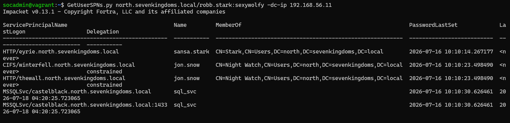
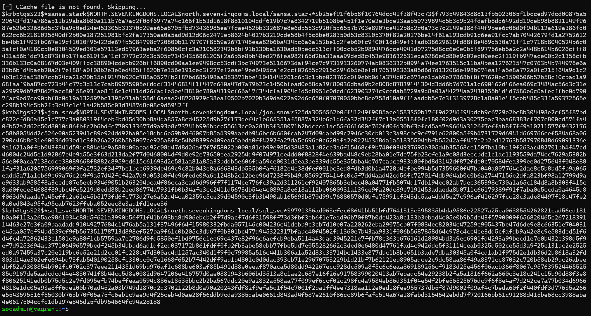
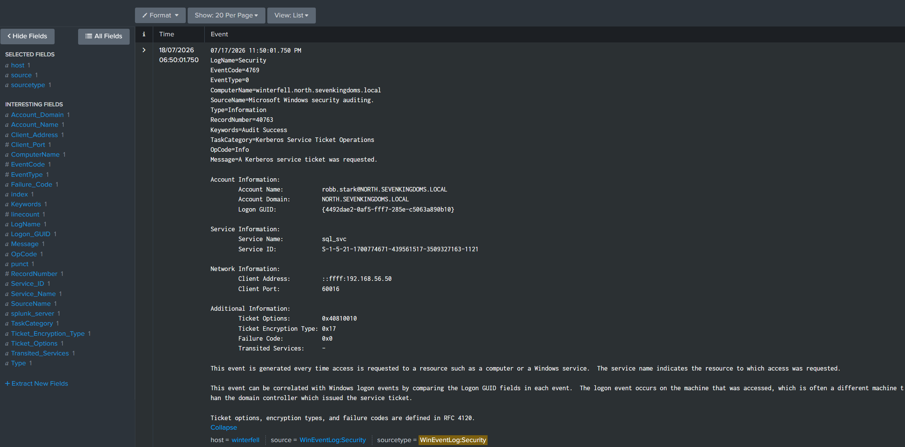
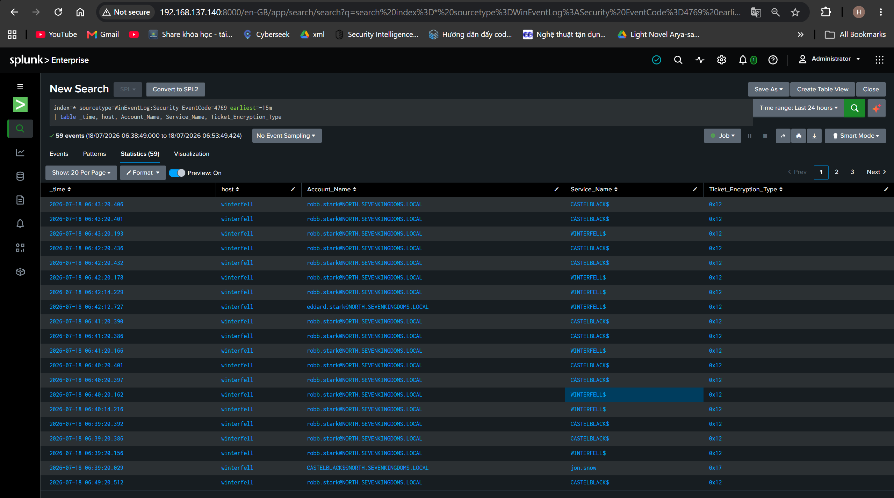
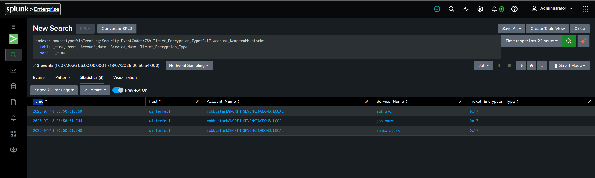
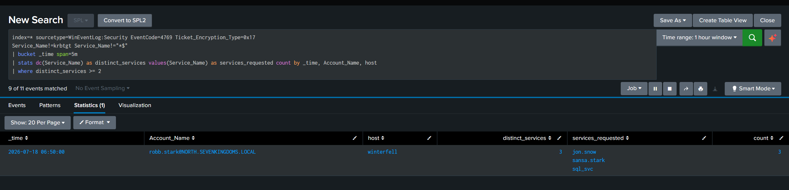

# Case 1 — Kerberoasting (T1558.003)

> Part 1 của series recap lab GOAD-Light + Splunk. Xem [Part 0 — Overview & Lab Setup](00-overview-lab-setup.md) để biết kiến trúc lab. Toàn bộ lệnh chạy từ VM `goad-soc` (192.168.56.50), đóng vai attacker.

## Bối cảnh

Đây là case đầu tiên, xuất phát điểm của attacker là **1 tài khoản domain thường** (không cần quyền admin) — cụ thể dùng `robb.stark` (mật khẩu đã biết trước từ vai trò build lab: `sexywolfy`). Mục tiêu: tìm tài khoản có Service Principal Name (SPN) đăng ký, xin vé Kerberos cho SPN đó, rồi mang vé đi bẻ offline để lấy mật khẩu thật của tài khoản service.

## Vì sao Kerberoasting hoạt động được

Khi 1 service (VD: MSSQL) chạy dưới 1 tài khoản domain thay vì tài khoản máy cục bộ, tài khoản đó cần đăng ký SPN để client tìm ra được nó qua Kerberos. Khi bất kỳ user nào (đã đăng nhập domain) xin vé TGS (Ticket Granting Service) cho SPN đó, **KDC sẽ cấp vé mà không kiểm tra người xin có quyền dùng service đó hay không** — việc phân quyền được đẩy xuống cho chính service tự kiểm tra khi vé được trình ra. Vé TGS được mã hoá bằng khoá dẫn xuất từ mật khẩu của tài khoản service — nếu dùng RC4 (etype 23), khoá đó chính là NTLM hash, có thể brute-force/dictionary-attack offline mà không chạm lại vào domain.

## Bước 1 — Recon: liệt kê tài khoản có SPN

```
GetUserSPNs.py north.sevenkingdoms.local/robb.stark:sexywolfy -dc-ip 192.168.56.11
```



Kết quả tìm được 3 tài khoản đáng chú ý trong `north.sevenkingdoms.local`:

| Tài khoản | SPN | Ghi chú |
|---|---|---|
| `sansa.stark` | `HTTP/eyrie.north.sevenkingdoms.local` | — |
| `jon.snow` | `CIFS/winterfell.north.sevenkingdoms.local`, `HTTP/thewall.north.sevenkingdoms.local` | Có delegation (dùng ở Case 3) |
| `sql_svc` | `MSSQLSvc/castelblack.north.sevenkingdoms.local(:1433)` | Mục tiêu kinh điển — service account MSSQL |

## Bước 2 — Khai thác: xin vé + lấy hash

```
GetUserSPNs.py north.sevenkingdoms.local/robb.stark:sexywolfy -dc-ip 192.168.56.11 -request
```



Cả 3 tài khoản trả về hash dạng `$krb5tgs$23$*<user>$...` — số `23` là mã etype RC4-HMAC. Với hash này, attacker có thể mang đi Hashcat (mode 13100) chạy offline hoàn toàn tách biệt khỏi lab, không tạo thêm log nào trên DC nữa.

## Bước 3 — Phát hiện: từ log thô đến rule sạch

### 3a. Xem 1 event 4769 thô để hiểu cấu trúc



Field quan trọng: `Ticket Encryption Type: 0x17`, `Transited Services: -` (rỗng — baseline bình thường, không có delegation liên quan).

### 3b. Search rộng — quá nhiều nhiễu

```spl
index=* sourcetype=WinEventLog:Security EventCode=4769 earliest=-15m
| table _time, host, Account_Name, Service_Name, Ticket_Encryption_Type
```



59 sự kiện trả về, đa số là `robb.stark` xin vé cho `CASTELBLACK$`/`WINTERFELL$` với `Ticket_Encryption_Type=0x12` (AES256) — đây là hoạt động nền bình thường của 1 con bot autologon GOAD cấy sẵn, **không phải** tấn công.

### 3c. Lọc theo encryption type + tài khoản attacker

```spl
index=* sourcetype=WinEventLog:Security EventCode=4769 Ticket_Encryption_Type=0x17 Account_Name=robb.stark*
| table _time, host, Account_Name, Service_Name, Ticket_Encryption_Type
| sort - _time
```



Còn lại đúng 3 sự kiện, cùng 1 timestamp (`06:50:01.7xx`), mỗi cái ứng với 1 SPN đã request — đây chính là dấu vết Kerberoasting thật, không lẫn nhiễu.

### 3d. Rule detect cuối cùng — mô hình hoá hành vi "burst"

Insight quan trọng: Kerberoasting bằng công cụ tự động có đặc trưng khác hẳn hoạt động Kerberos bình thường — **1 tài khoản xin vé cho nhiều SPN/service khác nhau trong 1 khoảng thời gian rất ngắn**. User thật thường chỉ xin vé rải rác cho 1-2 service họ thực sự dùng.

```spl
index=* sourcetype=WinEventLog:Security EventCode=4769 Ticket_Encryption_Type=0x17
Service_Name!=krbtgt Service_Name!="*$"
| bucket _time span=5m
| stats dc(Service_Name) as distinct_services values(Service_Name) as services_requested count by _time, Account_Name, host
| where distinct_services >= 2
```



Giải thích từng điều kiện lọc:
- `EventCode=4769` — chỉ event "TGS được cấp" (xin vé service, không phải xin TGT ban đầu).
- `Ticket_Encryption_Type=0x17` — chỉ giữ vé RC4 (yếu, mục tiêu crack offline), loại vé AES256 hiện đại ít bị nhắm tới.
- `Service_Name!=krbtgt` — loại request TGT thông thường.
- `Service_Name!="*$"` — loại SPN của computer account (luôn kết thúc bằng `$`) — máy tự xin vé cho chính nó là hành vi bình thường.
- `bucket _time span=5m` + `stats dc(Service_Name)... by _time, Account_Name, host` + `where distinct_services >= 2` — gom theo cửa sổ 5 phút, đếm số service riêng biệt 1 account request; ≥2 trong 5 phút là dấu hiệu bất thường.

Kết quả: `robb.stark` → `distinct_services = 3` (`jon.snow`, `sansa.stark`, `sql_svc`) trong cùng 1 khoảng 5 phút — chính xác khớp với đòn tấn công vừa chạy.

## Alert

| Thiết lập | Giá trị |
|---|---|
| Tên | `Kerberoasting - RC4 SPN burst request` |
| Alert Type | Scheduled, Cron `*/5 * * * *` |
| Time Range | Last 15 minutes |
| Trigger Condition | Number of Results > 0 |
| Action | Add to Triggered Alerts, Severity **High** |

Đã kiểm chứng: chạy lại đòn tấn công, chờ 1 chu kỳ cron, alert tự bắn trong **Activity → Triggered Alerts** — không cần con người can thiệp ở bước phát hiện.

## Tóm tắt kỹ thuật

| Mục | Chi tiết |
|---|---|
| ATT&CK | [T1558.003 — Steal or Forge Kerberos Tickets: Kerberoasting](https://attack.mitre.org/techniques/T1558/003/) |
| Điều kiện cần | 1 tài khoản domain bất kỳ (không cần đặc quyền) |
| Log sinh ra | EventCode 4769 trên Domain Controller |
| Chữ ký phát hiện | RC4 (0x17) + burst ≥2 service riêng biệt trong 5 phút |
| Hạn chế của rule | Không bắt được nếu attacker giãn request ra nhiều giờ, hoặc target chỉ có 1 SPN duy nhất |
